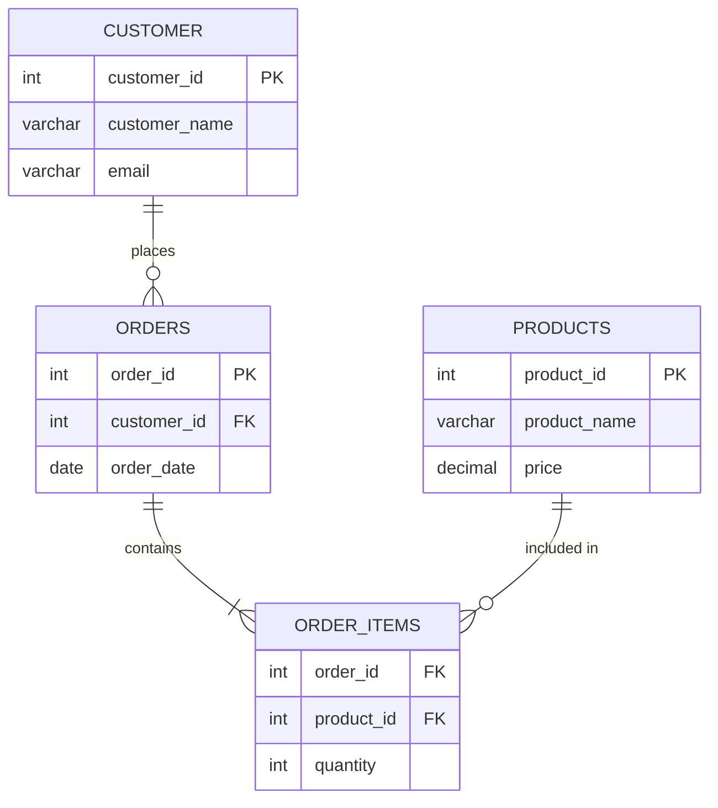

# 🛒 Online Store and Customer Database

A MySQL database design project for practicing online store and customer management concepts.

This repository contains a MySQL Workbench database model for an online store and customer system. It is designed to practice relational database design, tables, relationships, primary keys, foreign keys, and Entity-Relationship modeling.

---

## 📚 Table of Contents

- [About This Repository](#-about-this-repository)
- [Repository Files](#-repository-files)
- [Database Design](#-database-design)
- [ER Model](#-er-model)
- [Key Database Concepts](#-key-database-concepts)
- [Relationships](#-relationships)
- [MySQL Concepts Practiced](#-mysql-concepts-practiced)
- [Example SQL](#-example-sql)
- [Database Learning Flow](#-database-learning-flow)
- [Technologies Used](#-technologies-used)
- [Learning Goals](#-learning-goals)
- [Future Topics](#-future-topics)
- [Author](#-author)

---

## 🧠 About This Repository

This repository is part of my journey to learn MySQL and Database Management Systems.

The project focuses on designing a database for an online store and customer management system.

The repository currently contains a MySQL Workbench model file that can be opened and explored using MySQL Workbench.

---

## 📂 Repository Files

The repository currently contains:

| File | Description |
|---|---|
| `README.md` | Documentation for the repository |
| `online_store&customer.mwb` | MySQL Workbench database model |

The `.mwb` file contains the database model created using MySQL Workbench.

---

## 🗄️ Database Design

An online store database can be used to organize information related to:

- Customers
- Products
- Orders
- Store information
- Customer purchases
- Relationships between different entities

A relational database stores this information in separate tables and connects the tables using keys.

---

## 🔗 ER Model

The MySQL Workbench model represents the database structure using an Entity-Relationship (ER) model.



- A **Customer** can place many **Orders** (one-to-many).
- An **Order** can contain many **Order Items**, and each **Order Item** links to one **Product** — this is how the many-to-many relationship between Orders and Products is resolved using a junction table.

The exact tables and relationships can be explored further by opening the `.mwb` file in MySQL Workbench.

---

## 🔑 Key Database Concepts

### Primary Key

A primary key uniquely identifies each record in a table.

```sql
CREATE TABLE customer (
    customer_id INT PRIMARY KEY,
    customer_name VARCHAR(100)
);
```

### Foreign Key

A foreign key connects one table to another.

```sql
CREATE TABLE orders (
    order_id INT PRIMARY KEY,
    customer_id INT,
    FOREIGN KEY (customer_id)
        REFERENCES customer(customer_id)
);
```

This creates a relationship between customers and orders.

---

## 🔄 Relationships

Relational databases use relationships to connect related data.

### One-to-One

One record in one table is related to one record in another table.

```text
Customer ───── Customer Details
```

### One-to-Many

One record can be related to multiple records.

```text
Customer
   |
   ├── Order 1
   ├── Order 2
   └── Order 3
```

For an online store, a customer can typically place multiple orders.

### Many-to-Many

Multiple records from one table can relate to multiple records from another table.

This is commonly handled using a junction or bridge table.

```text
Customers
    ↕
Orders / Order Details
    ↕
Products
```

---

## 🧩 MySQL Concepts Practiced

This project helps practice:

- Database design
- Tables
- Columns
- Rows
- Primary keys
- Foreign keys
- Relationships
- Entity-Relationship modeling
- MySQL Workbench
- Relational databases
- Online store database structure

---

## 💻 Example SQL

### Creating a Customer Table

```sql
CREATE TABLE customer (
    customer_id INT PRIMARY KEY,
    customer_name VARCHAR(100),
    email VARCHAR(100)
);
```

### Creating an Order Table

```sql
CREATE TABLE orders (
    order_id INT PRIMARY KEY,
    customer_id INT,
    order_date DATE,
    FOREIGN KEY (customer_id)
        REFERENCES customer(customer_id)
);
```

### Inserting Customer Data

```sql
INSERT INTO customer
VALUES (1, 'Hemanth', 'hemanth@example.com');
```

### Viewing Customers

```sql
SELECT *
FROM customer;
```

### Viewing Orders

```sql
SELECT *
FROM orders;
```

---

## 🔄 Database Learning Flow

```text
Database Basics
       ↓
Tables
       ↓
Columns & Data Types
       ↓
Primary Keys
       ↓
Foreign Keys
       ↓
Relationships
       ↓
ER Modeling
       ↓
MySQL Workbench
       ↓
Online Store Database
       ↓
Advanced SQL
```

---

## 🛠️ Technologies Used

- 🐬 MySQL
- 💻 MySQL Workbench
- 🗃️ SQL
- 🔧 Git
- 🐙 GitHub

---

## 🎯 Learning Goals

This repository helps me practice:

- Understanding relational databases
- Designing database tables
- Understanding primary keys
- Understanding foreign keys
- Creating relationships between tables
- Understanding ER diagrams
- Using MySQL Workbench
- Designing an online store database
- Improving database design skills
- Understanding how customers and store data can be organized

---

## 🚀 Future Topics

More database concepts will be added as I continue learning.

Planned topics include:

- SELECT queries
- WHERE
- GROUP BY
- HAVING
- ORDER BY
- Aggregate functions
- JOIN
- INNER JOIN
- LEFT JOIN
- RIGHT JOIN
- Subqueries
- Constraints
- Normalization
- Views
- Indexes
- Stored Procedures
- Triggers
- Transactions
- Database Security

---

## 👨‍💻 Author

**Betha Hemanth**

This repository is part of my journey to learn MySQL, Database Management Systems, and SQL.

---

⭐ If you find this repository useful, feel free to explore the database model and follow my learning journey.
